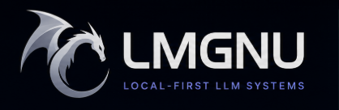

## LMGNU

LMGNU develops engineering frameworks for local-first Large Language Model (LLM) systems. We design practical, optimized architectures that enable both training and inference directly on local infrastructure - prioritizing data privacy, low latency, and resource efficiency.

---

### Core Repositories

| Repository | Purpose |
| :--- | :--- |
| [llm.cpp](https://github.com/LMGNU/llm.cpp) | Core inference engine optimized for localized, lightweight training. |
| [LLM-Engine](https://github.com/LMGNU/LLM-Engine) | python based resource management, pipeline orchestration. |
| [prism](https://github.com/LMGNU/prism) | Tooling and interfaces optimized for local data processing. |
| [nanollm](https://github.com/LMGNU/nanollm) | Compact LLM implementations simple and local training. |

---
